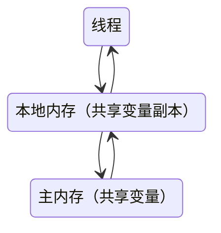

# 内存模型的基础

## 并发编程模型的两个问题

在并发编程中，需要处理两个关键问题

* 线程之间如何通信 - 线程之间以何种机制来交换信息
  * 共享内存
  * 消息传递
* 线程之间如何同步 - 用于控制不同线程间操作发生相对顺序的机制
  * 共享内存中，同步是显式进行，必须通过显式指定某个方法或某段方法需要再线程之间互斥执行
  * 消息传递中，同步是隐式进行，消息发送必须在消息的接受之前

Java 的并发采用的是**共享内存**模型，Java 线程之间的**通信总是隐式进行**


## Java  内存模型的抽象结构

* 共享变量
  * 实例域、静态域、数组元素
* 非共享
  * 局部变量
  * 方法定义参数
  * 异常处理参数


## Java 内存模型

java 内存模型简称 `JMM`，`JMM` 决定一个线程对共享变量的写入何时对另一个线程可见。

`JMM` 定义了线程和主内存之间的抽象关系

> 线程之间的共享变量存储在主内存中，每个线程都有一个私有的本地内存，本地内存中存储了该线程以读/写共享变量的副本
>
> 本地内存 `JMM` 是一个抽象的概念，并不真实存在



如果两个线程之间要通信，必须经历下面两个步骤

* `线程1` 把本地内存中更新过的共享变量刷新到主内存中去
* `线程2` 到主内存去读取 `线程1` 更新过的共享变量

从整体上来看，这两个步骤实质上是 `线程1` 向 `线程2` 发送消息，这个通信过程必须要经过主内存。`JMM` 通过控制主内存与每个线程的本地内存之间的交互，来为 Java程序员提供**内存可见性**的保证


## 指令重排序

在执行程序时，为了提高性能，编译器和处理器常常会对指令做重排序。重排序分三种

* 编译器优化的重排序（编译器） - 编译器在不改变单线程程序语句的前提下，可以重新安排语句的执行顺序
* 指令级并行的重排序（处理器） - 现代处理器采用了指令级并行技术（ILP）来将多条指令重叠执行，如果不存在数据依赖性，处理器可以改变语句对应机器指令的执行顺序
* 内存系统的重排序（处理器） - 由于处理器使用缓存和读/写缓冲区，使得加载和存储操作看上去可能是在乱序执行

对于处理器的重排序，`JMM` 的处理器重排序规则会要求 Java 编译器在生成指令序列时，插入特定类型的**内存屏障（Memory Barriers）**指令，通过内存屏障指令来禁止特定类型的处理器重排序


## 并发编程模型分类

```java
class ReorderingTest {

    static int x = 0, y = 0;

    static int a = 0, b = 0;

    @Test
    void testReordering() throws InterruptedException {
        while (true) {
            x = 0;
            y = 0;
            a = 0;
            b = 0;
            boolean reordering = reSort();
            if (reordering) {
                System.out.println("(" + x + "," + y + ")");
                break;
            }
        }
    }
    private boolean reSort() throws InterruptedException {
        Thread thread1 = new Thread(() -> {
            a = 1;
            x = b;
        });
        Thread thread2 = new Thread(() -> {
            b = 1;
            y = a;
        });
        thread1.start();
        thread2.start();
        thread1.join();
        thread2.join();
        return x == 0 && y == 0;
    }
}
```

为了保证内存可见性，Java 编译器在生成指令序列的合适位置会插入内存屏障指令来禁止特定类型的处理器重排序。JMM 把内存屏障分为 4 类

| 屏障类型            | 指令类型                 | 说明                                                         |
| ------------------- | ------------------------ | ------------------------------------------------------------ |
| LoadLoad Barriers   | Load1;LoadLoad;Load2     | 确保 Load1 数据的装载先于 Load2 及所有后续装载指令的装载     |
| StoreStore Barriers | Store1;StoreStore;Store2 | 确保 Store1 数据对其他处理器可见（刷新到内存）先于 Store2 及所有后续储备指令的存储 |
| LoadStore Barriers  | Load1;LoadStore;Store2   | 确保 Store1 数据装载先于 Store2 及所有后续的存储指令刷新到缓存 |
| StoreLoad Barriers  | Store1;StoreLoad;Load2   | 确保 Store1 数据对其他处理器变得可见（指刷新到内存）先于 Load2 及所有后续装载指令的装载。 StoreLoad Barriers 会使该屏障之前的所有内存访问指令（存储和装载指令）完成之后，才执行该屏障之后的内存访问指令 |

`StoreLoad Barriers` 是一个“全能型”的屏障，它同时具有其他 3 个屏障的效果。执行该屏障开销会很昂贵，因为当前处理器通常要把写缓冲区中的数据全部刷新到内存中


## Happens-before 简介

### 定义

两个操作之间具有 `happens-before` 关系，并**不意味**着前一个操作必须要在后一个操作之前执行。

`happens-before` 仅要求前一个操作（执行的结果）对后一个操作可见，且前一个操作按顺序排在第二个操作之前。


### 规则如下

* 程序顺序规则 - 一个线程中的每个操作，`happens-before` 于该线程中的任意后续操作
* 监视器锁规则 - 对一个锁的解锁，`happens-before` 于随后对这个锁的加锁
* volatile 变量规则 - 对一个 volatile 域的写，`happens-before` 于任意后续的这个 volatile 域的读
* 传递性 - 如果 A `happens-before` B，且 B `happens-before` C，那么 A `happens-before` C

